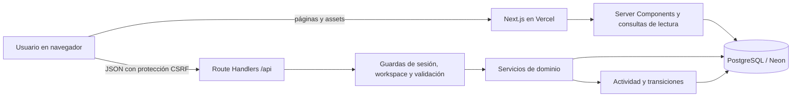
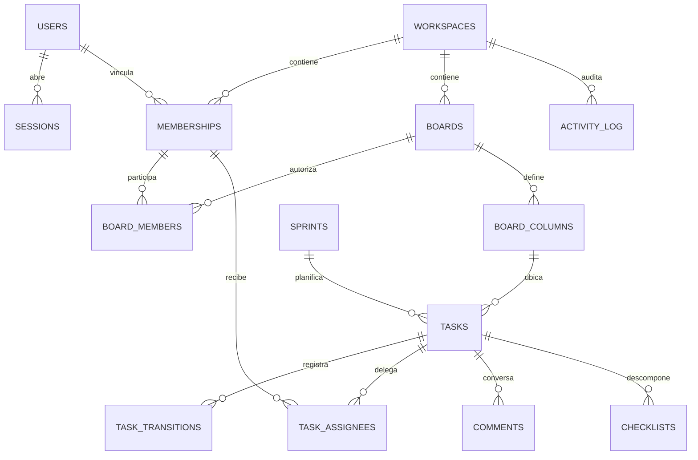
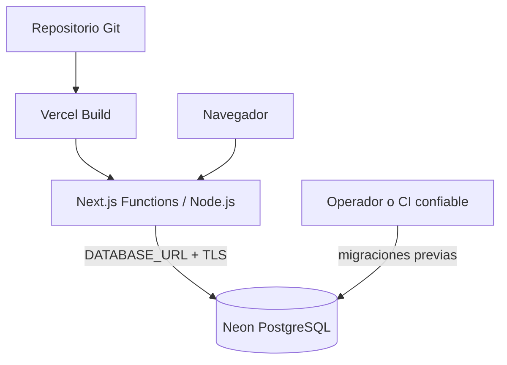

# Arquitectura de HegelFlow

> Fecha de corte: 27 de agosto de 2026. Este documento describe el código que existe en el repositorio, no una arquitectura futura ni la confirmación de un despliegue activo.

## Resumen

HegelFlow es un monolito web modular sobre Next.js App Router. Las páginas de servidor leen PostgreSQL directamente; las interacciones del navegador llaman Route Handlers JSON; estos validan la solicitud y delegan las reglas de negocio a servicios transaccionales. No existe un backend separado, una cola, un worker ni un servicio de archivos.

## Stack verificado

| Responsabilidad | Implementación actual |
| --- | --- |
| Renderizado y routing | Next.js 16.3, App Router y React 19.2 |
| Lenguaje | TypeScript 5 en modo `strict` |
| Estilos y componentes | Tailwind CSS 4, componentes propios, Lucide |
| Interacción del tablero | dnd-kit con sensores de puntero y teclado |
| Gráficas | Recharts |
| Fechas | APIs nativas `Date` e `Intl` |
| Base de datos | PostgreSQL mediante `postgres.js` |
| Validación | Zod 4 en la frontera HTTP y el dominio |
| Credenciales | bcryptjs, coste 12 |
| Pruebas | Vitest y cobertura V8 |
| Calidad y suministro | ESLint, TypeScript, auditoría local de secretos, `npm audit` y Dependabot semanal |

`package.json` exige Node.js `>=20.9.0` y limita scripts de instalación permitidos a las versiones fijadas de `esbuild@0.28.2` y `unrs-resolver@1.12.2`.

## Capas y dependencias

### Presentación

Las rutas de `src/app/(workspace)` son Server Components dinámicos. [`requirePageContext`](../src/lib/page-context.ts) obtiene la sesión y el primer workspace activo; si falta cualquiera, redirige a `/login`. El layout consulta los tableros y monta el `AppShell`.

Los componentes cliente controlan formularios, filtros, modales, drag-and-drop y actualizaciones optimistas. Envían JSON a `/api` con `Content-Type: application/json` y `X-CSRF-Protection: 1`; después usan `router.refresh()` para reconciliarse con PostgreSQL. El `AppShell` consulta una revisión con las mismas ACL de la actividad en `/api/sync` cada cinco segundos mientras la pestaña está visible y al recuperar el foco; si cambia, refresca los Server Components sin desmontar el estado no afectado del tablero.

No hay `middleware.ts` o `proxy.ts` global. La protección depende de la guarda del layout para páginas y de la autenticación explícita en cada handler API.

### Lecturas

[`src/lib/data.ts`](../src/lib/data.ts) contiene los modelos de lectura del dashboard, tableros, backlog, actividad, equipo, reportes y configuración. Las lecturas de trabajo reciben el `workspaceId`, la membresía y el nivel de acceso resueltos desde la sesión. `OWNER`/`ADMIN` ven todos los tableros del workspace; `MEMBER`/`VIEWER` solo los de alcance `WORKSPACE`, los creados por ellos o aquellos donde aparecen en `board_members`. No existe una capa de repositorios ni Row-Level Security en la base.

Las páginas del workspace declaran `dynamic = "force-dynamic"`; no se usa caché persistente para datos de negocio. `cache()` de React solo deduplica el contexto dentro de una renderización.

### Frontera HTTP

[`src/lib/api-mutation.ts`](../src/lib/api-mutation.ts) compone la mayoría de mutaciones:

1. verifica POST, origen, `Sec-Fetch-Site`, cabecera CSRF y JSON;
2. limita el cuerpo a 128 KiB;
3. exige sesión vigente;
4. resuelve el workspace activo;
5. traduce errores de seguridad y dominio a respuestas JSON sin exponer excepciones internas.

Los endpoints de login y logout aplican las mismas comprobaciones con un límite de cuerpo menor. Los GET de sesión, búsqueda y sincronización autentican de forma independiente y responden con `no-store`.

### Dominio

| Módulo | Responsabilidad |
| --- | --- |
| [`domain/activity.ts`](../src/lib/domain/activity.ts) | Revalidar membresía, allowlists por rol, concurrencia optimista y activity log |
| [`domain/boards.ts`](../src/lib/domain/boards.ts) | Crear tableros/columnas y crear/actualizar perfiles |
| [`domain/tasks.ts`](../src/lib/domain/tasks.ts) | Crear, editar, mover y archivar tareas; comentarios y checklists |
| [`domain/sprints.ts`](../src/lib/domain/sprints.ts) | Crear, iniciar y cerrar sprints; asignar tareas |
| [`domain/validators.ts`](../src/lib/domain/validators.ts) | Contratos Zod, normalización y errores estables |
| [`permissions.ts`](../src/lib/permissions.ts) | Vocabulario de permisos y matriz RBAC reutilizable |

Las mutaciones relevantes se ejecutan dentro de transacciones. Bloquean filas de workspace, tablero, columna o tarea con `FOR UPDATE`/`FOR SHARE` según el caso, vuelven a comprobar el actor y registran actividad dentro de la misma transacción.

## Módulos visibles

| Ruta | Estado actual |
| --- | --- |
| `/login` | Login con usuario/contraseña y mensajes genéricos |
| `/` | Métricas, sprint activo, carga, tableros y vencimientos |
| `/boards/[boardId]` | Kanban/lista, filtros, WIP, crear/editar/archivar/mover tareas |
| `/backlog` | Backlog, asignación a sprint y creación de sprint |
| `/sprints` | Sprints activos, planificados e históricos; inicio y cierre |
| `/calendar` | Vista mensual de inicios, vencimientos y límites de sprint |
| `/reports` | Burndown, velocidad, estados, prioridades y tiempo de ciclo |
| `/activity` | Cronología de actividad de negocio |
| `/team` | Perfiles, capacidad y creación de perfil operativo |
| `/settings` | Lectura de configuración, toggle de reglas y cambio de contraseña |

La búsqueda global consulta título, descripción o clave de tarea y limita el resultado a 12 elementos.

### Operaciones API implementadas

- Autenticación: login, logout, consulta de sesión y cambio de contraseña.
- Trabajo: crear/editar/archivar/mover tarea y asignarla a sprint.
- Colaboración de dominio: crear comentarios y checklists; crear/actualizar elementos de checklist.
- Scrum: crear, iniciar y completar sprint.
- Organización: crear tablero, crear/actualizar perfil.
- Configuración: activar o pausar una regla de automatización.

No todas estas operaciones tienen hoy un control de interfaz. Por ejemplo, hay backend para comentarios y checklists, pero el editor de tarea solo muestra sus contadores; existe actualización de perfiles, pero el botón de edición aún no abre un flujo funcional.

## Modelo de datos

La migración inicial está en [`db/migrations/001_initial.sql`](../db/migrations/001_initial.sql).

### Identidad y organización

- `users`: cuenta de acceso global, estado, locale y zona horaria.
- `sessions`: hash del token, agente, hash de IP y expiración.
- `login_attempts`: rate limit distribuido por hashes de usuario e IP.
- `workspaces`: frontera organizacional y configuración base.
- `memberships`: perfil laboral, capacidad, estado y nivel de acceso. El cargo (`work_role`) no concede permisos.

El esquema admite varios workspaces por usuario, pero la interfaz selecciona la primera membresía activa y todavía no ofrece selector.

### Trabajo ágil

- `boards` usa metodología `KANBAN`, `SCRUM` o `HYBRID` y visibilidad `WORKSPACE`/`PRIVATE`; `board_members` agrega acceso `ADMIN`, `MEMBER` u `OBSERVER` al tablero.
- `board_columns` conserva posición, categoría semántica y límite WIP.
- `tasks` admite epic, story, task y bug; prioridad, puntos, estimación, fechas, padre, reportero, sprint, archivado y versión optimista.
- Relaciones: varios responsables y etiquetas, checklists, comentarios con borrado lógico, adjuntos, dependencias y campos personalizados.
- `sprints` conserva objetivo, fechas y estado. Los índices parciales permiten un sprint activo por tablero y, por separado, un sprint general activo con `board_id IS NULL` dentro del workspace.

Triggers de alcance rechazan asociaciones cruzadas entre workspaces para tareas/columnas/sprints/padres, miembros de tablero, responsables, etiquetas, dependencias, valores personalizados, autores de comentarios y adjuntos. Son defensa de integridad, no una política de lectura equivalente a RLS.

### Trazabilidad

- `activity_log` es la cronología legible por el equipo, conserva `board_id` para filtrar ACL y se escribe junto con las mutaciones de dominio.
- `task_transitions` registra creación, movimiento, cambio de sprint, cambio de estimación, completado, reapertura y archivo. Conserva puntos anteriores/actuales y un trigger impide `UPDATE` o `DELETE`.
- `security_audit_events` está separado de la actividad de negocio y sí tiene triggers que impiden actualización o borrado.

## Invariantes de negocio

- Toda mutación vuelve a comprobar que usuario, membresía y workspace sigan activos.
- `VIEWER` no escribe; `MEMBER` trabaja sobre tareas; `ADMIN` y `OWNER` gestionan tableros, sprints y perfiles.
- En un tablero `PRIVATE`, `OWNER`/`ADMIN` del workspace conservan acceso global; los demás necesitan ser creador o miembro explícito para leer, y acceso `ADMIN`/`MEMBER` de tablero para escribir. `OBSERVER` solo lee.
- Un administrador no puede crear o elevar otro `ADMIN`/`OWNER`; solo un propietario puede hacerlo.
- No se puede desactivar o degradar al último propietario activo.
- Las tareas usan un entero `version`; una edición sobre una versión antigua responde `409 VERSION_CONFLICT`.
- El límite WIP se valida tanto en el cliente como en el servidor, con bloqueo de columnas durante el movimiento.
- Entrar en una columna `DONE` establece `completed_at`; salir de ella reabre la tarea.
- Las tareas de un sprint completado o cancelado son inmutables para las operaciones cubiertas por el dominio.
- Los índices parciales garantizan un sprint activo por tablero y uno general por workspace; distintos tableros pueden ejecutar sprints en paralelo.
- Crear, mover, completar, reabrir, archivar, cambiar de sprint o cambiar story points agrega una transición con actor y valores relevantes.

## Reportes

[`getReportData`](../src/lib/data.ts) calcula:

- conteo actual por columna y prioridad;
- velocidad de hasta ocho sprints completados, tomando por tarea el primer evento de entrada al sprint como compromiso inicial;
- promedio y percentil 85 del tiempo desde la primera entrada en `IN_PROGRESS` hasta completar;
- burndown diario del sprint activo.

Es una primera versión. Los cambios de story points ya producen eventos `ESTIMATE_CHANGED`, pero el burndown todavía usa el alcance que actualmente pertenece al sprint y elige un solo sprint activo accesible sin selector explícito. Aún no representa con precisión cada cambio histórico de alcance. Las fórmulas deben contrastarse con casos reales antes de usarlas para decisiones contractuales o de desempeño.

## Persistencia, migraciones y seed

[`scripts/migrate.ts`](../scripts/migrate.ts) serializa ejecuciones con un advisory lock de sesión, crea `schema_migrations`, ordena los `.sql` por nombre y aplica cada archivo pendiente dentro de una transacción. La carrera entre dos migradores se probó sobre una base limpia. No hay migraciones reversibles ni job de despliegue incluido.

[`scripts/seed.ts`](../scripts/seed.ts) es idempotente en sus entidades principales. Crea o actualiza:

- una cuenta administradora obtenida solo de variables de entorno;
- un workspace, un propietario y un perfil operativo sin cuenta;
- un tablero híbrido con cinco columnas y límites WIP;
- un sprint, etiquetas, tareas, checklist, comentario, campos, vista y regla de ejemplo.

Reejecutar el seed vuelve a hashear y establecer la contraseña del administrador. Es una herramienta de aprovisionamiento, no una migración ordinaria.

## Topología Vercel + Neon

`db()` reutiliza un cliente por instancia mediante `globalThis`, con `max: 1`, timeout de conexión, sentencias preparadas desactivadas y TLS `verify-full` para hosts no locales. La URL se interpreta antes de conectar, elimina el parámetro `channel_binding` que postgres.js 3.x no soporta y solo desactiva TLS para hosts locales exactos. Esto limita conexiones por función, pero no reemplaza el pooling de Neon ni el monitoreo de conexiones bajo escalado horizontal.

Cada ambiente debe tener su propia `DATABASE_URL` y su `APP_URL`. Preview no debe compartir datos de producción. Las migraciones deben ejecutarse explícitamente antes de promover una versión que dependa del nuevo esquema; el build no las ejecuta. Como el migrador toma un advisory lock de sesión, exige la URL directa (`DATABASE_URL_UNPOOLED` en Neon) y rechaza hostnames `-pooler`.

## Pruebas y auditoría

El repositorio contiene pruebas unitarias para:

- validación de solicitudes y utilidades criptográficas;
- matriz RBAC y prevención de escalamiento;
- contratos del dominio y errores estables;
- utilidades de presentación.

La suite `test:integration` migra PostgreSQL real y cubre ACL de tableros privados, edición+sprint atómica, WIP y versiones optimistas, agregados de sprint sin fuga privada, visibilidad de automatizaciones/vistas, rechazo de relaciones entre workspaces e inmutabilidad de transiciones. GitHub Actions levanta PostgreSQL 18 y ejecuta esa suite en cada cambio.

`npm run audit:all` encadena escaneo de patrones sensibles, lint, generación/comprobación de tipos, cobertura, build y vulnerabilidades de severidad alta. [GitHub Actions](../.github/workflows/quality.yml) ejecuta esas etapas en cada pull request y push a `main`, con permisos de solo lectura y `npm ci`; Dependabot revisa dependencias npm semanalmente.

La ejecución local de corte terminó en verde: 26 pruebas unitarias y 6 de integración aprobadas, migración/seed repetibles en PostgreSQL 18, build de producción correcto y 0 vulnerabilidades de npm. La cobertura unitaria fue 20,19 % de sentencias y 21,41 % de líneas; sigue siendo insuficiente para considerar exhaustivamente probado el dominio transaccional.

Además pasó un smoke HTTP autenticado de login, todas las páginas principales, creación/movimiento/archivo de tarea, conflicto de versión, comentarios, checklist y búsqueda. Aún no hay automatización E2E de navegador/Route Handlers, pruebas de concurrencia simultánea ni umbrales mínimos de cobertura configurados.

## Límites y decisiones pendientes

- La visibilidad y autorización multi-tenant viven principalmente en consultas y servicios. Triggers de alcance rechazan varias relaciones cruzadas en la base, pero no existe RLS.
- La ACL `PRIVATE` funciona en las vistas principales y mutaciones y tiene cobertura negativa de integración sobre sus agregados críticos; no tiene todavía interfaz/API para administrar `board_members` ni una matriz E2E exhaustiva por ruta.
- Backlog, calendario y sprints toman el primer tablero activo; falta selección/multiproyecto completa.
- Los bloqueos a nivel de workspace simplifican la consistencia, pero son gruesos; locks por tablero/sprint serían una optimización futura si aumenta la concurrencia.
- Automatizaciones solo pueden activarse o pausarse: no existe motor, cola, reintentos ni historial de ejecuciones.
- Adjuntos no tienen almacenamiento ni endpoint; notificaciones e invitaciones no tienen entrega o consumo.
- Campos personalizados y vistas guardadas se leen en configuración, pero no tienen CRUD completo ni aplicación en tareas.
- No hay un sistema de recuperación de cuenta, invitación consumible, correo, MFA o SSO.
- No hay observabilidad, alertas, backups ni restauración configurados desde el repositorio.
- Las operaciones aún no cubren exportación, borrado de workspace o integraciones aunque el vocabulario RBAC las contemple.

La secuencia propuesta para cerrar estas brechas está en [product-scope.md](product-scope.md); los controles y riesgos se detallan en [security-model.md](security-model.md).
