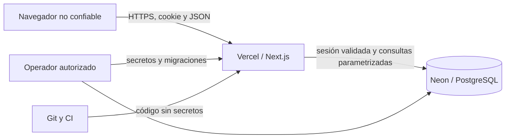

# Modelo de seguridad de HegelFlow

> Fecha de corte: 27 de agosto de 2026. El modelo se basa en la implementación del repositorio. Los controles administrados de Vercel y Neon —cifrado, backups, protección de despliegues, logs o alertas— solo pueden considerarse activos después de verificarlos en esas cuentas.

## Objetivos

HegelFlow debe proteger:

- credenciales, cookies de sesión y cadenas de conexión;
- datos de personas, capacidad y actividad del proyecto;
- separación entre workspaces y entre niveles de acceso;
- integridad del flujo, los sprints, límites WIP y reportes;
- atribución de cambios de negocio y eventos de autenticación;
- disponibilidad frente a abuso de login, solicitudes excesivas y errores de base.

El producto es una aplicación interna, pero no asume que la red, el navegador, un usuario autenticado o una Preview sean confiables por defecto.

## Fronteras de confianza

- Todo valor del navegador se considera no confiable, incluidos UUID, versión, rol aparente y `workspaceId`.
- Vercel ejecuta la aplicación con un rol de base que actualmente tiene acceso amplio al esquema.
- PostgreSQL no aplica Row-Level Security; la capa de aplicación es la frontera de lectura multi-tenant. Triggers de alcance impiden varias asociaciones cruzadas como defensa de integridad.
- Git debe contener código y valores de ejemplo, nunca credenciales utilizables.

## Autenticación

### Credenciales

- El usuario se normaliza con Unicode NFKC, trim y minúsculas para buscarlo sin diferencias engañosas.
- Las contraseñas se almacenan con bcrypt, coste 12.
- La verificación usa un hash señuelo cuando el usuario no existe o no tiene contraseña, para reducir diferencias temporales observables.
- Los errores de login no distinguen entre usuario inexistente, deshabilitado o contraseña incorrecta.
- El alta, el seed y el cambio de contraseña exigen al menos 14 caracteres y rechazan entradas que bcrypt truncaría después de 72 bytes UTF-8.
- El cambio de contraseña exige además la actual y que la nueva sea distinta. Revoca las demás sesiones, pero conserva la sesión desde la que se hizo el cambio.

### Rate limit de login

[`src/lib/security.ts`](../src/lib/security.ts) mantiene contadores en PostgreSQL por:

- hash SHA-256 de la IP, si el proxy entrega una IP válida;
- hash SHA-256 del nombre de usuario normalizado.

La ventana es de 15 minutos, el umbral es cinco intentos y el bloqueo dura 15 minutos. La actualización usa `INSERT ... ON CONFLICT`, por lo que se comparte entre instancias serverless. Los registros antiguos se limpian durante solicitudes de login, como máximo una vez por hora en cada proceso; no existe un job dedicado.

La IP se toma primero de `x-real-ip` y después del primer valor de `x-forwarded-for`, validado como IP. Esta confianza es adecuada detrás de un proxy controlado como Vercel; en otro hosting deben eliminarse cabeceras aportadas directamente por el cliente.

### Sesiones

- Token opaco de 32 bytes aleatorios, codificado en base64url.
- Solo su SHA-256 se guarda en `sessions`; el valor reutilizable vive en la cookie.
- Cookie `__Host-hegelflow-session`, `HttpOnly`, `Secure`, `SameSite=Lax`, `Path=/` y prioridad alta.
- Duración fija de 12 horas, sin refresh silencioso.
- Máximo práctico de diez sesiones por cuenta; al crear otra se eliminan las más antiguas.
- Logout borra la sesión en PostgreSQL y expira la cookie aun si la revocación remota falla.
- Solo usuarios y membresías `ACTIVE` producen un contexto válido.
- Respuestas de login/sesión/logout usan `no-store`; no deben quedar en cachés compartidas.

Las sesiones expiradas se purgan al crear una nueva, no mediante un proceso programado. `last_seen_at` existe en el esquema pero no se actualiza y no hay una pantalla administrativa para revisar o revocar sesiones individuales.

## Protección de mutaciones HTTP

La función `assertMutationRequest` exige simultáneamente:

- método POST;
- cabecera `Origin` válida y perteneciente al origen de la solicitud, `APP_URL` o al host reenviado aceptado;
- `Sec-Fetch-Site` diferente de `cross-site`;
- `X-CSRF-Protection: 1`;
- `Content-Type: application/json`.

El JSON se lee con límite de 8 KiB en autenticación y 128 KiB en las mutaciones generales. Los contratos son objetos Zod estrictos: campos desconocidos o tipos incorrectos se rechazan. Las consultas se construyen con parámetros de `postgres.js`; el único SQL no parametrizado es el contenido de migraciones controladas por el repositorio.

Esta defensa combina SameSite, validación de origen y una cabecera que un formulario HTML de otro sitio no puede agregar por sí solo. `APP_URL` debe ser el origen HTTPS exacto de cada ambiente. No use comodines ni un dominio de Preview compartido con terceros.

## Autorización y aislamiento

HegelFlow separa:

- `users`: identidad que inicia sesión;
- `memberships`: perfil dentro de un workspace;
- `work_role`: cargo descriptivo, por ejemplo CEO o desarrollador;
- `access_level`: nivel técnico que concede permisos.

Cada mutación vuelve a consultar la membresía y el usuario dentro de la transacción. No confía en el rol enviado por el cliente ni únicamente en el contexto leído al renderizar la página.

### Acceso efectivo de las operaciones actuales

| Operación | OWNER | ADMIN | MEMBER | VIEWER |
| --- | :---: | :---: | :---: | :---: |
| Leer workspace y tableros autorizados | Sí, todos | Sí, todos | Sí, por visibilidad/ACL | Sí, por visibilidad/ACL |
| Crear, editar y mover tareas | Sí | Sí | Sí | No |
| Asignar una tarea a sprint | Sí | Sí | Sí | No |
| Comentar y gestionar checklists | Sí | Sí | Sí | No |
| Archivar tareas | Sí | Sí | No | No |
| Crear tableros/columnas | Sí | Sí | No | No |
| Crear, iniciar o completar sprints | Sí | Sí | No | No |
| Crear o actualizar perfiles | Sí | Sí, con límites | No | No |
| Crear o vincular credenciales de otra persona | Sí | No | No | No |
| Consultar la consola de auditoría | Sí | No | No | No |
| Activar o pausar automatizaciones | Sí | Sí | No | No |
| Cambiar la propia contraseña | Sí | Sí | Sí | Sí |

Restricciones adicionales:

- un `ADMIN` no puede crear, modificar ni elevar perfiles `ADMIN` o `OWNER`;
- solo `OWNER` puede crear cuentas o vincular credenciales y ningún flujo permite crear otro `OWNER`;
- un `OWNER` no puede dejar al workspace sin otro propietario activo;
- en un tablero `PRIVATE`, un `MEMBER` necesita acceso de tablero `ADMIN` o `MEMBER` para escribir; `OBSERVER` solo lee;
- las tareas deben pertenecer al workspace y el tablero/columna/sprint indicado debe ser compatible;
- las versiones optimistas evitan sobrescribir una edición concurrente sin avisar.

[`permissions.ts`](../src/lib/permissions.ts) define también permisos futuros como exportación, borrado, auditoría e integraciones. Que un rol aparezca con ese permiso no significa que ya exista el endpoint correspondiente.

### ACL de tableros privados

`board_members` concede acceso de tablero `ADMIN`, `MEMBER` u `OBSERVER`. El comportamiento actual es:

- `OWNER` y `ADMIN` del workspace pueden leer y administrar todos los tableros;
- `MEMBER` y `VIEWER` leen tableros `WORKSPACE`, los que crearon o aquellos donde tienen una fila en `board_members`;
- para escribir en `PRIVATE`, un actor que no es `OWNER`/`ADMIN` necesita además acceso de tablero `ADMIN` o `MEMBER`;
- `OBSERVER` es lectura solamente;
- crear un tablero agrega a su creador como `ADMIN` del tablero.

Dashboard, navegación, tablero, backlog, calendario, equipo, búsqueda y reportes aplican esta condición. La actividad conserva `board_id` y filtra sus eventos; configuración filtra reglas ligadas a tableros y el alcance de vistas guardadas. Aún falta una interfaz/API para administrar miembros del tablero y una prueba negativa automatizada por cada camino de lectura, incluido el caso de un sprint general que contenga tareas de tableros con ACL distintas.

## Integridad y concurrencia

- Las mutaciones usan transacciones y bloqueos de fila con un orden consistente.
- Las tareas incluyen `version`; una versión antigua causa `409`.
- El servidor valida el límite WIP bajo bloqueo de las columnas, no solo en el drag-and-drop del cliente.
- Índices parciales permiten un sprint activo por tablero y uno general por workspace, evitando duplicados dentro de cada alcance.
- Restricciones `CHECK`, claves foráneas e índices únicos refuerzan estados, roles, prioridades y relaciones.
- Triggers rechazan relaciones cruzadas de tareas, sprints/columnas/padres, miembros de tablero, responsables, etiquetas, dependencias, campos, comentarios y adjuntos.
- Las tareas de sprints cerrados no se pueden editar, mover, archivar o reasignar mediante los servicios cubiertos.
- Completar/reabrir actualiza `completed_at`; cambiar story points agrega `ESTIMATE_CHANGED` con valor anterior/nuevo.
- La actividad de negocio se escribe en la misma transacción que el cambio.

`task_transitions` y `security_audit_events` tienen triggers que impiden actualización o borrado. Los identificadores históricos de las transiciones no usan claves foráneas con cascada, para evitar que borrar otra entidad destruya el registro; las escrituras deben seguir pasando por el dominio.

## Auditoría

Hay dos registros separados:

### Actividad de negocio

`activity_log` contiene `board_id`, actor, entidad, acción, resumen y metadata para tareas, sprints, perfiles, tableros y configuración. La página `/activity` muestra eventos generales y aquellos cuyo tablero está autorizado; `OWNER`/`ADMIN` conservan visibilidad global.

### Eventos de seguridad

`security_audit_events` registra actualmente:

- login exitoso o fallido;
- login bloqueado por rate limit;
- logout;
- cambio de contraseña exitoso o fallido.
- creación de cuenta y vinculación de credenciales, incluidos intentos administrativos denegados.

Conserva request id, referencias opcionales a usuario/sesión/membresía, hash de IP y metadata acotada. Un sanitizador recursivo elimina claves sensibles antes de persistir metadata; las rutas de cuentas solo aportan identificadores y nivel de destino. No guarda la contraseña, cookie, token ni cadena de conexión. Dos triggers de PostgreSQL impiden `UPDATE` y `DELETE`.

El registro de seguridad es *best effort*: si falla no cambia la respuesta y solo emite un mensaje genérico al runtime. `/settings/audit` muestra a `OWNER` métricas y los últimos 50 eventos relacionados con el workspace, después de revalidar en PostgreSQL la cuenta, membresía y rol. La consulta no selecciona IP, hash de IP, sesión ni metadata. Todavía no registra de forma central todos los `403`, cambios de rol o exportaciones, y no hay política de borrado ni exportación.

## Cabeceras del navegador

[`next.config.ts`](../next.config.ts) aplica globalmente:

- Content Security Policy con `default-src 'self'`, bloqueo de objetos, bases y frames externos;
- `frame-ancestors 'none'` y `X-Frame-Options: DENY`;
- HSTS por dos años, subdominios y preload;
- `X-Content-Type-Options: nosniff`;
- `Referrer-Policy: strict-origin-when-cross-origin`;
- política de permisos que desactiva cámara, micrófono, geolocalización, pagos y USB;
- `Cross-Origin-Opener-Policy: same-origin`;
- eliminación de `X-Powered-By`.

La CSP permite scripts y estilos inline, y en desarrollo permite `unsafe-eval`. Es compatible con el stack actual, pero no es una CSP estricta con nonce. Si se introduce HTML enriquecido, integraciones o scripts externos, deben revisarse CSP y sanitización antes de habilitarlos.

## Secretos y configuración

Las únicas variables de aplicación actuales son:

| Variable | Sensibilidad | Política |
| --- | --- | --- |
| `DATABASE_URL` | Crítica | Secret de Vercel/CI; nunca Git, cliente o logs |
| `APP_URL` | No secreta | Origen exacto por ambiente |
| `BOOTSTRAP_ADMIN_USERNAME` | Interna | Solo durante aprovisionamiento |
| `BOOTSTRAP_ADMIN_PASSWORD` | Crítica | Temporal; retirar al terminar el seed |

No existe `AUTH_SECRET`: las sesiones no son JWT y su token se genera aleatoriamente por sesión.

El `.gitignore` excluye `.env*`, `.vercel`, claves PEM, builds y logs. `npm run audit:secrets` revisa archivos rastreados y no ignorados en busca de claves privadas, tokens, JWT, URLs PostgreSQL con credenciales y asignaciones sospechosas.

Limitaciones del escáner:

- no inspecciona el historial Git;
- usa patrones, no validación contra proveedores;
- no reemplaza GitHub Secret Scanning ni una herramienta como gitleaks/trufflehog;
- un resultado verde no demuestra que nunca se expuso un secreto.

Si una credencial se expone, no basta con borrarla del archivo: hay que revocarla o rotarla, revisar el historial y los logs, invalidar sesiones afectadas y volver a desplegar con el valor nuevo.

## Datos y privacidad

- El cliente exige TLS `verify-full` para bases no locales, valida el hostname del certificado y solo reconoce hosts locales exactos para desarrollo sin TLS.
- El pool se limita a una conexión por instancia y desactiva prepared statements por compatibilidad serverless.
- IP de sesión y auditoría se almacena como SHA-256; el user agent de sesión sí se conserva en texto hasta 512 caracteres.
- Los hashes de IP son deterministas y sin una clave secreta; reducen exposición accidental, pero no equivalen a anonimización fuerte.
- Actividad, auditoría y transiciones no tienen retención automática.
- El repositorio no configura backups, Point-in-Time Restore, regiones, cifrado de proveedor ni residencia de datos. Deben verificarse en Neon y Vercel.

No hay carga de archivos funcional. Antes de implementar adjuntos se necesita un object store privado, antivirus, allowlist de MIME, límite de tamaño, nombres generados, URLs firmadas y autorización en descarga.

## Pruebas y controles de suministro

Pruebas actuales:

- seguridad HTTP, token opaco, normalización y límite de JSON;
- matriz de permisos y escalamiento de roles;
- validadores de tareas, tableros, sprints y errores de dominio;
- utilidades de interfaz.
- integración PostgreSQL para ACL `PRIVATE`, atomicidad tarea+sprint y cuenta+perfil, WIP/versiones, reportes, actividad/configuración, aislamiento entre workspaces, guardas de auditoría y transiciones append-only.

El gate `npm run audit:all` ejecuta auditoría de secretos, ESLint, generación/comprobación de tipos, Vitest con cobertura, build y `npm audit --audit-level=high`. GitHub Actions repite las etapas en pull requests y pushes a `main`, con permisos `contents: read`, instalación reproducible y timeout. Dependabot está configurado semanalmente para npm. `package.json` fija Node.js `>=20.9.0` y autoriza scripts de instalación únicamente para `esbuild@0.28.2` y `unrs-resolver@1.12.2`; cualquier cambio de esas versiones debe volver a revisarse.

La suite PostgreSQL contiene 11 pruebas de integración aprobadas en CI sobre una base aislada. Todavía debe ampliar de forma repetible:

- denegación de cada mutación por rol;
- carreras simultáneas de WIP y sprint activo;
- revocación/expiración de sesiones y rate limit concurrente;
- matriz E2E por ruta para tableros privados y seguridad audit;
- flujos E2E de login, cambio de contraseña y logout.

## Riesgos pendientes priorizados

| Prioridad | Riesgo | Tratamiento requerido |
| --- | --- | --- |
| P0 | Lectura multi-tenant sin RLS | Pruebas multi-tenant y rol DB de mínimo privilegio; evaluar RLS |
| P0 | Alta administrativa sin recuperación ni rotación inicial obligatoria | Invitaciones de un solo uso, expiración, recuperación y revocación |
| P0 | Operación no verificada | Backups/PITR, migraciones controladas, logs, alertas y runbook |
| P1 | Auditoría de seguridad parcial | Registrar denegaciones y cambios sensibles restantes; exportación solo OWNER |
| P1 | Historial protegido pero sin retención/exportación | Definir retención, acceso y recuperación sin mutar eventos |
| P1 | Sin MFA/SSO | MFA para propietarios; SSO/OIDC según tamaño del equipo |
| P1 | E2E HTTP/navegador no automatizado de extremo a extremo | Convertir el smoke manual en un gate repetible y ampliar la matriz por rol |
| P1 | ACL privada sin administración ni matriz exhaustiva por ruta | Añadir CRUD de `board_members` y pruebas negativas de cada Route Handler |
| P2 | CSP permite inline | Migrar a nonce/hash si el modelo de amenazas lo exige |
| P2 | Hash de IP sin clave y retención indefinida | HMAC/rotación o minimización, con política documentada |

## Checklist antes de producción

- [ ] Mantener la matriz negativa de todos los read paths de `PRIVATE` y añadir administración de `board_members`.
- [ ] Separar bases Neon de Development, Preview y Production.
- [ ] Crear un rol PostgreSQL de aplicación con mínimo privilegio.
- [ ] Configurar `DATABASE_URL` y `APP_URL` como variables por ambiente.
- [ ] Ejecutar migraciones desde un job confiable y registrar el resultado.
- [ ] Ejecutar el seed una sola vez, cambiar la contraseña inicial y retirar `BOOTSTRAP_*`.
- [ ] Ejecutar `npm run audit:all` sobre el commit exacto a desplegar.
- [ ] Probar los cuatro roles y el aislamiento entre dos workspaces.
- [ ] Verificar cookies, CSP, HSTS y respuestas `no-store` en Preview HTTPS.
- [ ] Configurar backup/PITR y ensayar una restauración.
- [ ] Configurar logs, alertas de errores, agotamiento de conexiones y fallos de login.
- [ ] Definir retención de actividad, auditoría, sesiones e intentos de login.
- [ ] Documentar responsables, rotación de credenciales y respuesta a incidentes.

Hasta completar los puntos P0, HegelFlow debe tratarse como un sistema interno en validación, no como repositorio definitivo de información altamente confidencial.
